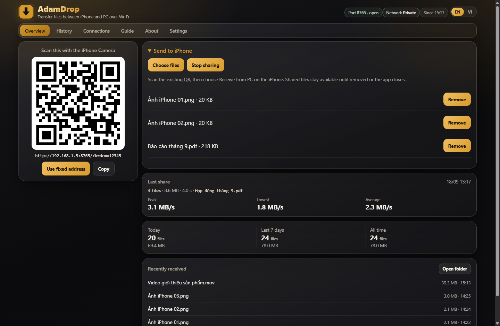
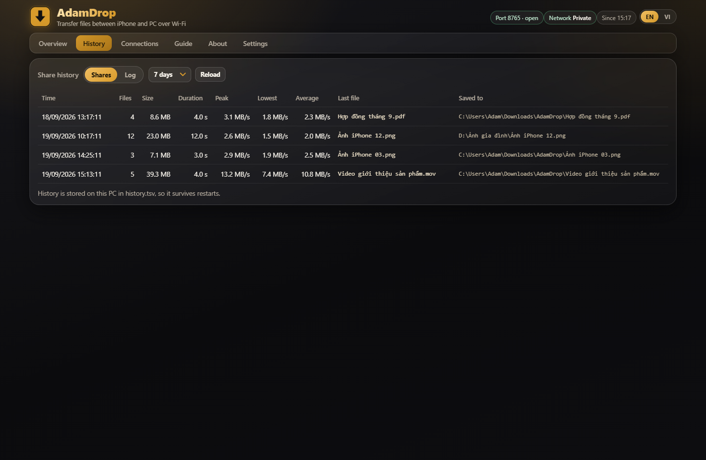
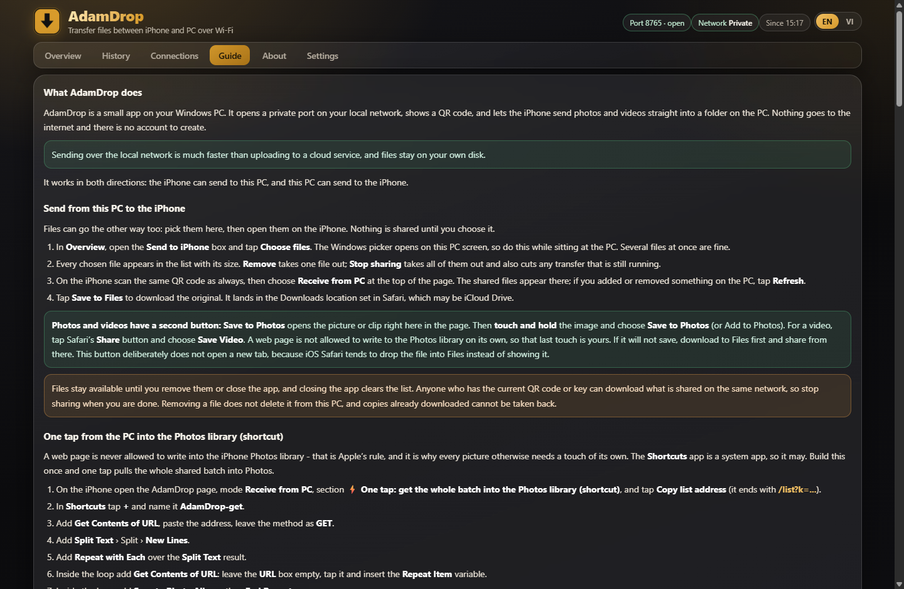
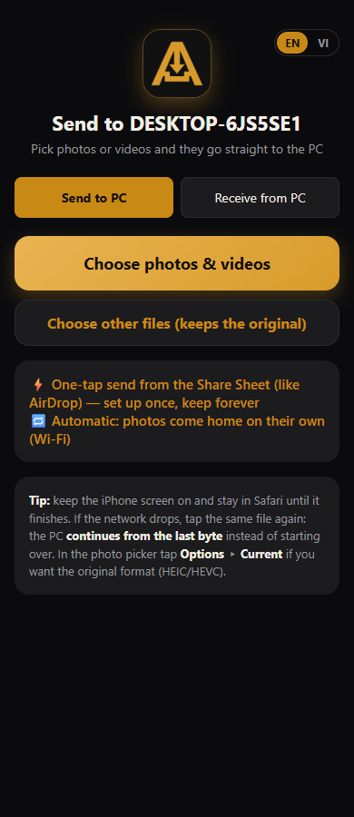
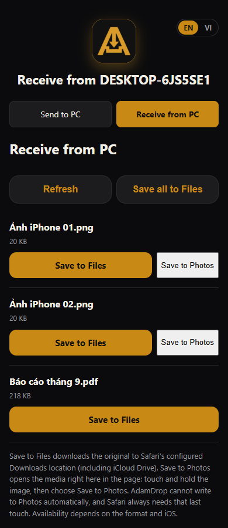

# AdamDrop

**Gửi ảnh, video và tệp giữa iPhone và PC Windows qua Wi-Fi. Quét mã QR là xong.**
Không cáp, không tài khoản, không đăng nhập, không đi qua máy chủ nào.


[Tiếng Việt](#tiếng-việt) · [English](#english) · [Hướng dẫn chi tiết](HUONG-DAN.txt)



---

## Tiếng Việt

### Vì sao có AdamDrop

AirDrop không chạy giữa iPhone và Windows. Còn Zalo, Google Drive, iCloud thì bắt đăng nhập, nén ảnh nhỏ lại, đẩy lên mây rồi mới tải xuống — chậm, và ảnh gia đình, video con, hợp đồng của bạn phải đi qua máy chủ của người khác.

AdamDrop đi thẳng trong nhà bạn. PC mở một máy chủ nhỏ, iPhone quét mã QR, hai bên nói chuyện trực tiếp qua Wi-Fi. Không có mây ở giữa, không ai khác nhìn thấy tệp của bạn.

### Tính năng

- **Hai chiều, một mã QR.** iPhone → PC và PC → iPhone dùng chung một mã, một trang. Đổi chiều bằng một nút.
- **Gửi cả loạt.** Chọn cả thư mục ảnh hay video 4 GB trong một lần. Trên iPhone thì dùng bảng Chia sẻ để gửi nhiều tệp cùng lúc.
- **Đứt Wi-Fi vẫn gửi tiếp.** Tệp được chia thành từng khối 8 MB kèm mã kiểm tra SHA-256; mất mạng hay khoá màn hình thì lần sau nó chạy tiếp đúng chỗ dừng, không gửi lại từ đầu.
- **Giữ nguyên bản gốc.** Không nén, không đổi tên, không đụng vào ngày chụp. Máy nhận đối chiếu SHA-256 nên biết chắc tệp đã về nguyên vẹn.
- **Vào Tệp hoặc vào Ảnh.** Ảnh và video có thêm đường lưu thẳng vào thư viện Ảnh của iPhone, các tệp khác thì vào Tệp.
- **Nhẹ thật.** Một tệp `AdamDrop.exe` khoảng 930 KB, toàn bộ giao diện nhúng bên trong. Không cài runtime, không service, không driver, không thư viện ngoài.
- **Nằm trong khay hệ thống.** Đóng cửa sổ là nó thu về khay và vẫn nhận tệp. Bật máy là tự chạy.
- **Lịch sử có số thật.** Mỗi đợt nhận ghi lại số tệp, dung lượng, thời gian, tốc độ cao nhất / thấp nhất / trung bình và cả thư mục đã lưu, để lần sau bạn biết tệp nằm ở đâu.
- **Song ngữ Anh – Việt**, mặc định tiếng Anh, đổi bằng một nút ở góc phải.
- **Chỉ trong mạng nhà.** Mỗi máy có một mã khoá riêng sinh tự động ở lần chạy đầu. Không có mã thì không gửi được tệp nào, dù cùng Wi-Fi.
- **Không tài khoản, không theo dõi.** Không đăng ký, không đăng nhập, không gọi về máy chủ nào. Tắt Wi-Fi ngoài là nó vẫn chạy trong nhà.

### Bắt đầu trong 30 giây

1. Tải bản phát hành, giải nén, bấm phải `install.bat` → **Run as administrator** (chỉ một lần, để mở cổng và thêm tường lửa).
2. Trên iPhone: mở **Camera**, quét mã QR trên màn hình PC, rồi bấm liên kết hiện ra.
3. Chọn ảnh/video/tệp → bấm **Gửi**. Tệp rơi vào thư mục Tải về (hoặc thư mục bạn chọn trong tab **Settings**).

Chiều ngược lại: trên PC bấm **Choose files** trong ô **Send to iPhone**, rồi trên iPhone chọn **Receive from PC**.

### Cài đặt

**Cách 1 — dùng bản phát hành (khuyến nghị)**

Vào [Releases](../../releases), tải `AdamDrop.zip`, giải nén ra một thư mục bất kỳ (ví dụ `C:\AdamDrop`), rồi bấm phải `install.bat` → **Run as administrator**.

Bộ cài sẽ: biên dịch lại từ mã nguồn bằng `csc.exe` có sẵn trong Windows → mở cổng 8765 cho chương trình → thêm tường lửa cho cả mạng riêng tư, miền và công cộng → đặt tự chạy khi đăng nhập → tạo lối tắt ngoài Desktop → mở luôn bảng điều khiển.

**Cách 2 — tự biên dịch**

```bat
git clone https://github.com/adamwang99/AdamDrop.git
cd AdamDrop
build.bat
```

`build.bat` chỉ cần .NET Framework 4 (Windows 10/11 nào cũng có sẵn). Muốn cài đầy đủ (mở cổng + tường lửa + tự chạy) thì chạy `install.bat` bằng quyền quản trị.

**Gỡ cài đặt:** bấm phải `uninstall.bat` → **Run as administrator**. Chương trình sẽ xoá cổng, tường lửa, tự chạy và lối tắt. Tệp bạn đã nhận vẫn còn nguyên.

### Lấy ảnh từ PC vào thư viện Ảnh của iPhone

Đây là chỗ nhiều người hỏi nhất, nên nói thẳng: **không trang web nào ghi được vào thư viện Ảnh của iPhone.** Đó là luật của Apple — mỗi ảnh phải có một lần chạm của người dùng. Phím tắt thì được, vì nó là ứng dụng hệ thống. Vì vậy AdamDrop có bốn đường:

| Cách | Số lần chạm | Kết quả |
|---|---|---|
| **Lưu vào Tệp** | 1 lần cho mỗi tệp | Bản gốc vào Tệp (Tải về / iCloud Drive) |
| **Lưu tất cả vào Tệp** | **1 lần cho cả loạt** | Cả loạt vào Tệp |
| **Lưu vào Ảnh** | 1 lần cho mỗi ảnh | Mở ảnh ngay trong trang, bạn **nhấn giữ** → **Lưu vào Ảnh** |
| **Phím tắt "Nhận từ PC"** | **1 lần cho cả loạt** | Cả loạt vào thẳng thư viện Ảnh |

Phím tắt đó chỉ cần dựng một lần trên iPhone (7 bước, có ảnh chụp thật trong tab **Hướng dẫn** của app):

1. Trang AdamDrop trên iPhone → **Receive from PC** → sao chép **địa chỉ danh sách**.
2. App **Phím tắt** → **+** → đặt tên `AdamDrop-nhan`.
3. `Lấy nội dung của URL` → dán địa chỉ, để phương thức **GET**.
4. `Tách văn bản` → Tách → **Dòng mới**.
5. `Lặp lại với từng mục trong` → chọn kết quả của *Tách văn bản*.
6. Trong vòng lặp: `Lấy nội dung của URL` → để trống ô URL → chèn biến **Lặp lại mục**.
7. Trong vòng lặp: `Lưu vào Album ảnh` → rồi `Kết thúc lặp lại`.

Từ đó mỗi lần bấm chạy là toàn bộ ảnh PC đang chia sẻ về thẳng thư viện Ảnh. Muốn lưu vào Tệp thay vì Ảnh thì đổi tác vụ cuối thành `Lưu vào Tệp`.

### An toàn và riêng tư

- **Mã khoá riêng cho từng máy**, sinh tự động ở lần chạy đầu và lưu trong `adamdrop.ini` cạnh tệp exe. Mã khoá **không bao giờ** bị ghi vào nhật ký.
- **Chỉ trong mạng cục bộ.** Máy chủ chỉ nghe trên máy bạn; các đường quản trị (`/api/*`) chỉ nhận yêu cầu từ chính máy đó, thao tác thay đổi còn phải là POST kèm mã phiên và Host hợp lệ.
- **Chặn đi lang thang.** Tên tệp có `..\` bị chặn; tệp ghi ra `.part` rồi mới đổi tên; không ghi đè tệp cũ mà thêm `(1)`; tệp thiếu byte thì không tính là xong.
- **Không mây, không telemetry.** Không có tài khoản nào để rò rỉ. Muốn kiểm chứng thì mã nguồn nằm ngay trong kho này, tất cả trong `AdamDrop.cs`.
- **Mạng công cộng.** Bộ cài mở cổng cho cả mạng công cộng để bạn dùng được ở quán cà phê. Nếu chỉ dùng ở nhà, bạn có thể xoá luật tường lửa `AdamDrop` và thêm lại chỉ cho mạng riêng tư.

### AdamDrop giữ những tệp gì

| Tệp | Nội dung | Giới hạn |
|---|---|---|
| `adamdrop.ini` | cổng, mã khoá, thư mục lưu, ngôn ngữ, tên máy hiện trên điện thoại | — |
| `history.tsv` | lịch sử từng đợt nhận, 9 cột, kèm thư mục đã lưu | 2000 đợt |
| `recent.tsv` | danh sách tệp vừa nhận | 30 tệp |
| `adamdrop.log` | nhật ký chạy (không có mã khoá) | 200 dòng |

Tất cả nằm cạnh `AdamDrop.exe`, không ghi vào registry, không rải rác trong hệ thống.

### Cấu trúc kho

```
AdamDrop.cs        toàn bộ chương trình: máy chủ HTTP.sys, upload/gửi tiếp, giao diện, khay hệ thống
build.bat          biên dịch ra một tệp exe, nhúng toàn bộ web/ vào trong
install.bat        cài đặt: biên dịch, mở cổng, tường lửa, tự chạy, lối tắt Desktop
uninstall.bat      gỡ sạch những gì bộ cài đã làm
web/index.html     trang trên iPhone (gửi và nhận)
web/dashboard.html bảng điều khiển trên PC (6 tab, song ngữ)
web/guide/*.png    ảnh chụp thật của từng bước trên iOS
tools/*.py         sinh tệp Phím tắt dựng sẵn (tuỳ chọn, cho máy cũ)
tests/             bộ kiểm thử gửi/nhận tệp
HUONG-DAN.txt      hướng dẫn chi tiết bằng tiếng Việt và tiếng Anh
docs/              ảnh dùng trong README này
```

### Yêu cầu

Windows 10 hoặc 11 (64-bit), .NET Framework 4 (có sẵn trong Windows), và iPhone cùng một mạng Wi-Fi với PC. Không cần mở cổng trên router, không cần cáp, không cần Internet.

### Câu hỏi thường gặp

**iPhone báo "Không thể mở phím tắt" khi bấm nút cài phím tắt?**
Từ iOS 26, Apple chặn tệp phím tắt chưa được họ ký. Đó là lý do app có sẵn cách **dựng phím tắt bằng tay** kèm ảnh chụp từng bước — cách đó luôn chạy và không cần bật công tắc nào.

**Lưu ảnh mà nó vào Tệp chứ không vào Ảnh?**
Đúng như thiết kế của iOS, xem mục *Lấy ảnh từ PC vào thư viện Ảnh* ở trên. Muốn cả loạt vào Ảnh trong một lần chạm thì dùng phím tắt.

**Điện thoại không mở được mã QR?**
Kiểm tra hai máy cùng một Wi-Fi, và tường lửa đã cho phép (chạy lại `install.bat`). Trong tab **Connections** có sẵn các địa chỉ khác để thử; nếu máy hay đổi IP, bật **Use fixed address** để dùng tên máy `.local` thay vì địa chỉ IP.

**Có dùng được khi mạng để chế độ "Public"?**
Có. Bộ cài mở cổng cho cả ba loại mạng.

**Diệt virus cảnh báo?**
Đây là tệp exe không ký số, tự biên dịch từ mã nguồn trong kho này. Bạn có thể tự chạy `build.bat` để tạo ra tệp exe từ mã nguồn bạn đọc được.

**Dữ liệu của tôi có đi đâu không?**
Không. AdamDrop không có máy chủ, không có tài khoản, không gửi số liệu. Tệp chỉ đi từ máy này sang máy kia trong mạng của bạn.

### Giấy phép và liên hệ

MIT — xem [LICENSE](LICENSE). Dùng tự do, kể cả trong công việc kinh doanh; chỉ cần giữ dòng bản quyền.

AdamDrop được làm bởi **Adam Wang** (Vương Hoàng Tuấn) — [adamusesai.com](https://adamusesai.com) · [YouTube @adamdungai](https://youtube.com/@adamdungai) · [GitHub adamwang99](https://github.com/adamwang99). Có lỗi hay muốn thêm tính năng thì mở [issue](../../issues) giúp mình nhé.

---

## English

### Why AdamDrop exists

AirDrop does not work between an iPhone and Windows. Cloud apps and chat apps do — but they want an account, they shrink your photos, and they push your family pictures, your kids' videos and your contracts through somebody else's server before you get them back.

AdamDrop stays inside your home. Your PC opens a tiny server, your iPhone scans a QR code, and the two talk straight to each other over your own Wi-Fi. Nothing in the middle, nobody else watching.

### Features

- **Both directions, one QR code.** iPhone → PC and PC → iPhone share the same code and the same page. One button switches direction.
- **Whole batches at once.** Pick a folder of photos or a 4 GB video in one go; on iPhone, send many files in one trip through the Share Sheet.
- **Survives a dropped Wi-Fi.** Files travel in 8 MB chunks with SHA-256 checksums, so after a disconnect or a locked screen the next run resumes exactly where it stopped instead of starting over.
- **Originals, untouched.** No compression, no renaming, no touching capture dates. The receiving side verifies SHA-256, so you know the file arrived intact.
- **Save to Files or Save to Photos.** Images and videos also have a route straight into the iPhone Photos library; everything else goes to Files.
- **Genuinely light.** One `AdamDrop.exe`, about 930 KB, with the whole interface embedded. No runtime, no service, no driver, no third-party library.
- **Lives in the tray.** Close the window and it drops back to the tray, still receiving. It starts with Windows.
- **Real history.** Every receiving batch records file count, size, duration, peak / lowest / average speed and the folder it was saved to, so you can find things later.
- **English and Vietnamese**, English by default, one button to switch.
- **Home network only.** Each machine gets its own key, generated on first run. Without the key nobody can send you a single file, even on the same Wi-Fi.
- **No account, no tracking.** No sign-up, no login, no call home. Turn off your internet connection and it keeps working.

### Get going in 30 seconds

1. Download the release, unzip it, right-click `install.bat` → **Run as administrator** (once, to open the port and add the firewall rule).
2. On the iPhone open **Camera**, scan the QR code on the PC screen and tap the link.
3. Pick photos, videos or files → **Send**. They land in your Downloads folder (or whatever you choose on the **Settings** tab).

The other direction: on the PC click **Choose files** under **Send to iPhone**, then on the iPhone tap **Receive from PC**.

### Install

**Option 1 — release build (recommended).** Grab `AdamDrop.zip` from [Releases](../../releases), unzip anywhere (for example `C:\AdamDrop`), right-click `install.bat` → **Run as administrator**. The installer compiles the source with the `csc.exe` already in Windows, opens port 8765 for the app, adds firewall rules for private, domain and public networks, sets it to start at login, creates a Desktop shortcut and opens the dashboard.

**Option 2 — build it yourself.**

```bat
git clone https://github.com/adamwang99/AdamDrop.git
cd AdamDrop
build.bat
```

`build.bat` needs nothing but .NET Framework 4, which ships with Windows 10/11. Run `install.bat` as administrator for the full setup (port, firewall, autostart).

**Uninstall:** right-click `uninstall.bat` → **Run as administrator**. It removes the port reservation, firewall rules, autostart entry and shortcut. Files you received are left alone.

### Getting PC photos into the iPhone Photos library

This is the question people ask most, so here it is plainly: **no web page is allowed to write into the iPhone Photos library.** That is Apple's rule — every photo needs a touch from the user. Shortcuts can, because it is a system app. So AdamDrop offers four routes:

| Route | Touches | Result |
|---|---|---|
| **Save to Files** | one per file | Original lands in Files (Downloads / iCloud Drive) |
| **Save all to Files** | **one for the whole batch** | The whole batch lands in Files |
| **Save to Photos** | one per photo | Opens in-page, you **touch and hold** → **Save to Photos** |
| **"Receive from PC" shortcut** | **one for the whole batch** | Everything goes straight into the Photos library |

The shortcut is built once on the iPhone (7 steps, with real screenshots in the app's **Guide** tab):

1. AdamDrop page on the iPhone → **Receive from PC** → copy the **list address**.
2. **Shortcuts** app → **+** → name it `AdamDrop-get`.
3. `Get Contents of URL` → paste the address, method stays **GET**.
4. `Split Text` → Split → **New Lines**.
5. `Repeat with Each` over the Split Text result.
6. Inside the loop: `Get Contents of URL` → leave the URL box empty → insert the **Repeat Item** variable.
7. Inside the loop: `Save to Photo Album`, then `End Repeat`.

Now one tap pulls every shared photo and video on the PC into your library. Swap the last action for `Save to Files` if you would rather have them in Files.

### Safety and privacy

- **A key per machine**, generated on first run and stored in `adamdrop.ini` next to the exe. The key is **never** written to the log.
- **Local network only.** The server listens on your machine; admin routes (`/api/*`) accept requests only from the local machine, and state-changing calls must be POSTs with a session token and a trusted Host.
- **No wandering.** Path traversal (`..\`) is blocked, files are written to `.part` and only then renamed, existing files are never overwritten (a `(1)` suffix is added), and a short download is never reported as complete.
- **No cloud, no telemetry.** There is no account to leak. The whole program is `AdamDrop.cs` in this repository — read it.
- **Public networks.** The installer opens the port for public networks too, so it works in a café. Home-only? Delete the `AdamDrop` firewall rule and re-add it for private networks alone.

### What AdamDrop keeps on disk

| File | Contents | Limit |
|---|---|---|
| `adamdrop.ini` | port, key, save folder, language, display name shown on the phone | — |
| `history.tsv` | one row per receiving batch, 9 columns, including the save folder | 2000 rows |
| `recent.tsv` | most recently received files | 30 files |
| `adamdrop.log` | run log (never contains the key) | 200 lines |

Everything sits next to `AdamDrop.exe`. Nothing is written to the registry, nothing is scattered around the system.

### Repository layout

```
AdamDrop.cs        the whole program: HTTP.sys server, upload/resume, UI, tray icon
build.bat          compiles one exe with all of web/ embedded
install.bat        install: compile, open port, firewall, autostart, Desktop shortcut
uninstall.bat      removes everything the installer did
web/index.html     the page on the iPhone (send and receive)
web/dashboard.html the dashboard on the PC (6 tabs, bilingual)
web/guide/*.png    real iOS screenshots for every step
tools/*.py         generates prebuilt Shortcut files (optional, for older iPhones)
tests/             transfer test suite
HUONG-DAN.txt      the full manual, Vietnamese and English
docs/              the screenshots used in this README
```

### Requirements

Windows 10 or 11 (64-bit), .NET Framework 4 (built into Windows), and an iPhone on the same Wi-Fi network as the PC. No router configuration, no cable, no internet connection.

### FAQ

**The iPhone says "Cannot Open Shortcut" when I tap the install button.**
Since iOS 26 Apple refuses unsigned shortcut files. That is why the app also ships a **build-the-shortcut-by-hand** guide with screenshots of every step — that path always works and needs no settings toggle.

**Why did my photo end up in Files instead of Photos?**
That is iOS by design; see *Getting PC photos into the iPhone Photos library* above. Use the shortcut if you want a whole batch in Photos with one tap.

**The phone cannot open the QR code.**
Check that both devices are on the same Wi-Fi and that the firewall rule is in place (run `install.bat` again). The **Connections** tab lists alternative addresses; if your PC changes IP often, turn on **Use fixed address** to advertise the `.local` machine name instead of an IP.

**Does it work when the network is set to "Public"?**
Yes. The installer opens the port for all three network profiles.

**My antivirus flags it.**
It is an unsigned exe compiled from the source in this repository. You can run `build.bat` yourself and get the same binary from code you can read.

**Where does my data go?**
Nowhere. AdamDrop has no server, no account and no telemetry. Files travel only between your own devices on your own network.

### License and contact

MIT — see [LICENSE](LICENSE). Use it freely, including commercially; just keep the copyright notice.

AdamDrop is built by **Adam Wang** (Vương Hoàng Tuấn) — [adamusesai.com](https://adamusesai.com) · [YouTube @adamdungai](https://youtube.com/@adamdungai) · [GitHub adamwang99](https://github.com/adamwang99). Found a bug or want a feature? Open an [issue](../../issues).

---

### Ảnh / Screenshots

| Lịch sử có số thật | Hướng dẫn có ảnh chụp iOS |
|---|---|
|  |  |

| iPhone gửi sang PC | iPhone nhận từ PC (Tệp hoặc Ảnh) |
|---|---|
|  |  |
